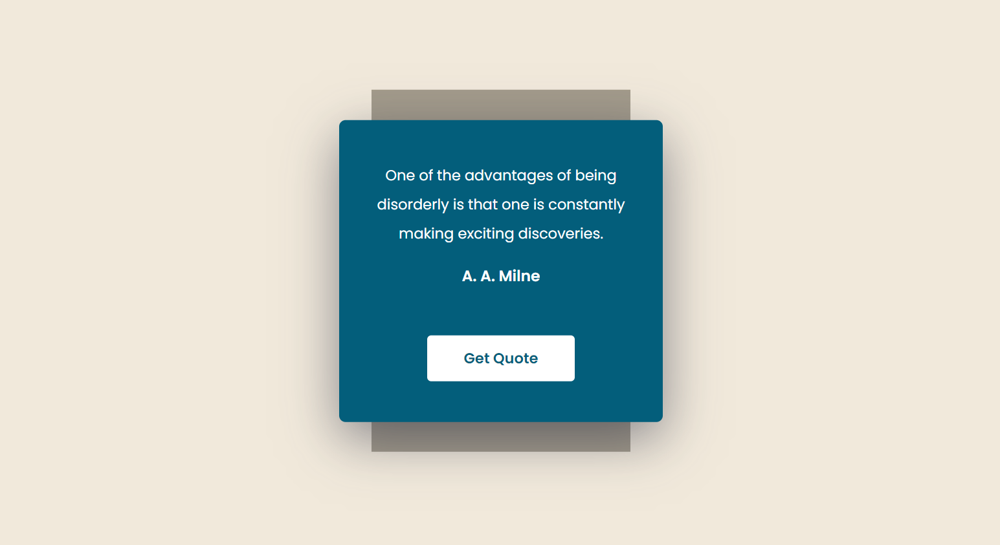

# Random Quote Generator

A simple web application that generates random quotes using the Quotable API.



## Table of Contents

- [Overview](#overview)
- [Features](#features)
- [Getting Started](#getting-started)
  - [Prerequisites](#prerequisites)
  - [Installation](#installation)
- [Usage](#usage)
- [Contributing](#contributing)
- [License](#license)

## Overview

This project is a random quote generator that fetches quotes from the Quotable API and displays them on a webpage. Users can click the "Get Quote" button to retrieve a new random quote.

## Features

- Fetches random quotes from the Quotable API.
- Simple and clean user interface.
- Responsive design.

## Getting Started

### Prerequisites

- Web browser (Chrome, Firefox, Safari, etc.)
- Internet connection

### Installation

1. Clone the repository:

   ```bash
   git clone https://github.com/Ayyushhh/Quote-Generator.git

2. Open the project in a code editor (e.g., Visual Studio Code).

3. Open the index.html file in a web browser or set up a local server for live development.

### Usage

1. Open the index.html file in a web browser.

2. Click the "Get Quote" button to fetch a random quote.

3. Enjoy reading the randomly generated quotes.

### Contributing

Contributions are welcome! If you have suggestions, feature requests, or find any issues, please create an issue or submit a pull request.

### License

This project is licensed under the MIT License.

Please make sure to replace placeholders like `your-username` and `your-repository` with your actual GitHub username and repository name. Additionally, if you have a specific license file (e.g., `LICENSE.txt`), you may want to adjust the license section accordingly.

Feel free to customize the README further based on additional details you'd like to provide about your project. Adding screenshots, usage examples, or detailed setup instructions can enhance the README and provide a better understanding for potential users.


